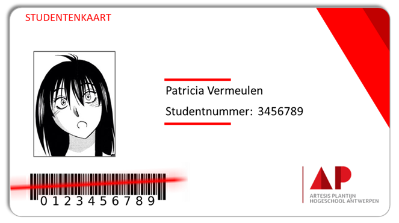

# Architectuur ScanMe toepassing

- _Verwachtingen voor elke paragraaf staan cursief gedrukt. Laat ze staan zolang dit document in ontwerpfase is maar denk eraan ze allemaal te verwijderen tegen versie 1.0_
- _Gelieve de structuur van dit document niet te wijzigen, om zo het nalezen ervan te vergemakkelijken_
- _Alle afbeeldingen moeten als fysisch bestand beschikbaar worden gemaakt in de `img` folder (urls dus niet toegelaten)_

Opdracht voor ICT Architecture

2019 - 2020

<small>Voornaam Naam</small>

---

## Samenvatting

- _Lees de [Wikipedia pagina](https://nl.wikipedia.org/wiki/Samenvatting) om te begrijpen wat een samenvatting is_
- _De bedoeling van deze paragraaf is om alle inhoud van dit document samen te vatten in maximaal een 100-tal leestekens._
- _Je volgt best deze structuur:_
  - _1 of 2 korte zinnen rond de probleemstelling_
  - _1 korte zin over de architectuur stijl je wil volgen_
  - _3 tot 7 zinnen over de uitwerking (views)_
  - _1 zin om te bespreken in hoeverre het voorstel/werk wel degelijk een antwoord biedt op de vooropgestelde probleemstelling_
- _Probeer de nieuwsgierigheid van de stakeholders te beantwoorden_
- _Vermijd schrijftaal_
- _Een samenvatting schrijf je al laatst_
- _Een samenvatting bevat steeds originele tekst, geschreven in je eigen woorden (dus niets letterlijk gekopieerd)

## Probleemstelling

De aanwezigheid van studenten tijdens de les wordt momenteel semi-automatisch afgenomen via Digitap. Voor examens gebeurt alles nog op papier, d.m.v. aftekenlijsten. Het idee bestaat om tijdens de examens en andere evenementen (zoals het stage-event of bedrijfsbezoek) de aanwezigheden te registreren door het inscannen van de studentenkaart.

Het inscannen zelf zou kunnen plaatsvinden door middel van 1. een smartphone van een lector of begeleider of 2. een barcode scanner zoals hieronder afgebeeld:

De bedoeling is om een workflow te bedenken alsook een applicatie voor het opnemen en opvolgen van de absenties. Hieronder wordt twee scenario's uitgewerkt:

### Scenario 1: Tijdens het examen

Vóór de aanvang van het examen en dus ook vóór de eerste student het examenlokaal binnentreedt, wordt de registratie voorbereid door een lector (in feite mag elk personeelslid van AP dit doen) door in een WebUntis-gekoppelde agenda van de applicatie eenvoudigweg het examen te kiezen. Daarop vraagt de applicatie de lector het lokaal te bevestigen. De applicatie tracht daarop verbinding te maken met één of meerdere alleenstaande barcode scanners. Er is ook de mogelijkheid om met de smartphone de registratie te doen, maar uiteraard moet het systeem zo ontworpen worden dat enkel personeelsleden en geen studenten hun smartphone kunnen gebruiken bij het registreren.

Tijdens het betreden van het examenlokaal dienen de studenten hun studentenkaart in te scannen ofwel bij een alleenstaande barcode scanner ofwel bij de lector die klaarstaat met zijn smartphone. Onmiddellijk tijdens het scannen moet de applicatie een popup tonen ter bevestiging dat een student zich heeft ingeschreven. De applicatie moet controleren of de student wel degelijk op dat examen verwacht wordt en moet een fout weergeven indien dit niet zo is, waarop de toezichter kan kiezen om de student te weigeren of toch toe te staan.

Op elke ogenblik tijdens het examen kan de lector:

- een lijst opvragen met alle geregistreerde studenten
- opzoeken of een student in deze lijst staat door een deel van de naam van die student op te geven
- in één oogopslag zien hoeveel studenten er geregistreerd zijn voor dit examen en hoeveel nog niet aanwezig zijn
- een opmerking toe te voegen voor een bepaalde student. Daarbij neemt de AP-vertegenwoordiger de kaart van de student, scant deze en voegt in de applicatie de opmerking toe
- Extra informatie op te vragen van een student door ofwel door te klikken op een student ofwel door de studentenkaart in te scannen

Na het afwerken van hun examenopdracht kan de lector een student uitschrijven nadat er gecontroleerd werd dat de student de opdracht correct indiende. Totdat de volgende student zich komt afmelden, moet deze actie eenvoudig ongedaan kunnen worden gemaakt.

Telkens wanneer een student in de applicatie vermeld staat, moet er van deze student de volgende informatie getoond worden:

- Foto
- Voornaam + Naam (in die volgorde)
- Student nummer
- Opleiding

Naast een aanwezigheidslijst, wil men in de toekomst ook (tegelijkertijd) andere lijsten kunnen hanteren zoals lijsten "ziek gemeld", "Zaal A", "aanwezig maar neemt niet deel", "te laat", …

Gaat er op technisch vlak iets misloopt met de scanner (zowel alleenstaande scanner of fototoestel van de smartphone), moet dit ook duidelijk zijn zowel voor de lector of toezichthouder als voor de student zodat deze opnieuw kan scannen. Bovendien moet er de mogelijkheid bestaan om het studentennummer (of eventueel naam) manueel in te geven.

### Scenario 2: Tijdens een Evenement

Tijdens een evenement moet er op gelijkaardige wijze als tijdens het examen afwezigheden kunnen worden afgenomen, opmerkingen toegevoegd en informatie opgevraagd. Een aantal verschillen:

- Hierbij is het gebruikelijk dat de student zichzelf uitschrijft uit de aanwezigheidslijst
- Op verplaatsing zal de begeleider eerder de smartphone gebruiken, bij een lokaal evenement zoals het stage-event is een alleenstaande scanner logischer
- Het zou leuk zijn mocht (=nice to have) een derde persoon (standhouder tijdens stage-event, bedrijfsverantwoordelijke tijdens bedrijfsbezoek) ook de student kunnen registreren (bijvoorbeeld voor interview, deelnemen aan specifieke workshop, etc…)

## Definities: Objecten, Actoren en Activiteiten

- _In deze paragraaf definieer je alle (=30-50) __actoren, objecten en acties__ die in de architectuur worden vernoemd_
- _De bedoeling van de definities is om alles dubbelzinnigheid uit de architectuur te halen_
- _Enkel termen die als dubbelzinnig kunnen worden opgevat, horen hier thuis_
- _In de rest van dit document mag je geen enkele actie, actor of object bespreken dat hier niet gedefinieerd staat!_
- _Wanneer je een definitie later in de tekst gebruikt, zet je deze __vetgedrukt__ zodat het voor de lezer duidelijk is dat het om een voorgedefinieerde term bestaat_

Dit zijn de objecten die centraal staan in de toepassing:

- __Scanner__ - Een alleenstaande barcode-scanner van het merk _[…]_
- _[…]_

Dit zijn de actoren die een rol hebben in de toepassing:

- __Begeleider__ - Een AP medewerker
- _[…]_

Hier volgen de definities van de relevante activiteiten:

- __Scannen__ - Het ofwel automatisch uitlezen van een __barcode__ ofwel het manueel invoeren van het __studentennummer__
- _[…]_

## Doelstelling

### Functionele Vereisten

- _Hier geef je een __genummerde__ lijst van de vereisten die beschrijven hoe de applicatie moet functioneren_
- _Met andere woorden, hier som je op __wat__ er moet gebeuren en niet __hoe__ het moet gebeuren_
- _Onder deze paragraaf mag je dus niet verwijzen naar enige technologie. Zo hoort het woord "databank" eerder thuis onder de technische vereisten_
- _Het is jouw taak om op basis van de probleemstelling een set van vereisten te extraheren_
- _Voorbeeld: "17. De __eindgebruiker__ kan tijdens het __raadplegen__ van de __lijst van historische commentaren__ deze sorteren volgens hun __relevantie__; zie nota […] voor het correct berekenen van __relevantie__"_

### Scenario's

- _Het aaneenrijgen van de functionele vereisten tot complete scenario's_

### Technische Vereisten

#### Accessibility

- _Doornummeren!_
- _Beantwoord hier de vraag: __Wie__ kan er aan het systeem?_

#### Availability

- _Beantwoord hier de vraag: __Wanneer__ en onder welke voorwaarden wordt het systeem beschikbaar?_

#### Configurability

- _Welke parametrisatie heeft de gebruiker zelf in de hand. Welke ‘Settings’ moeten er worden voorzien?_

#### Extensibility

- _In hoeverre kan het systeem in de toekomst worden uitgebreid met nieuwe modules?_

#### Performance

- _Wat zijn de vereisten op het vlak van respons-snelheid van het systeem?_

#### Maintainability

- _Hoe wordt ervoor gezorgd dat het systeem functioneel en up-to-date blijft ook na de lancering?_

#### Scalability

- _Hoe wordt er voorzien op een grotere groep gebruikers?_

#### Security

- _Hoe wordt ervoor gezorgd dat de veiligheid en privacy van de gebruiker gegarandeerd blijft?_

#### Supportability

- _Hoe wordt ervoor gezorgd dat de gebruiker geholpen wordt indien er iets mis gaat of indien de gebruiker niet begrijpt wat er moet gebeuren?_

#### Testability

- _Hoe kan het systeem getest worden, wat voor soort testen zijn hier relevant?_

#### Usability

- _Hoe wordt er gegarandeerd dat het systeem gemakkelijk is in gebruik?_

## Risico-analyse

- _Denk na over wat er kan fout lopeniets fout loopt_
- _Volg instructies in slides_
- _Focus op project-specifieke risico's_
- _Voeg minstens 5 risico's toe_

## Architectuur

- _Zie details voor afzonderlijke views onder h3 titels hieronder_
- _Verwijs naar de bovenstaande vereisten via hun nummers_

### Business View

- _Deze eerste view geeft visueel weer wat de meerwaarde is van jouw applicatie_
- _Bevat geen verwijzingen naar IT systemen__
- _Moet de belangrijkste activiteiten weergeven van jouw applicatie_
- _Moet de visie van de opdrachtgever weerspiegelen_
- _De business view moet gerelateerd kunnen worden aan de vereisten (verwijs naar de nummering!)_

### Functionele View

- _Introductie van actoren_
- _Omschrijving van scenario’s, wie doet wat_
- _Moet compatibel zijn met Business View_
- _Moet geëxtraheerd kunnen worden uit de functionele analyse_
- _Moet alle vereisten omvatten_
- _Deelsystemen mogen getoond worden maar denk zo functioneel mogelijk, i.e. vanuit standpunt van niet-technisch geschoolde eindgebruiker_
- _Door de pijlen in de functionele view te volgen moet elk scenario doorlopen kunnen worden_

### Informatie View

- _Welke informatie moet er tijdelijk of permanent worden bewaard?_
- _Wat zijn de informatiestromen?_
- _Wat zijn de datatypes_
- _Wat zijn de entiteiten, attributen en relaties met bijhorende kardinaliteiten_
- _Zijn er regels waaraan de gegevens moeten voldoen (bijv. Bereik.Einde > Bereik.Begin)?_
- _Alle objecten en actoren zouden moeten terug te vinden zijn in de Informatie view of bijhorende tekst_
- _De informatie view moet alle informatie bevatten om de toepassing te laten functioneren, maar niet méér dan dat_
- _De Informatie-blokken in de informatie flow moeten ook ergens in het entiteitendiagram terug te vinden zijn_

### Applicatie View

- _Kern van de architectuur_
- _Beschrijf grondig al de interfaces, ook met mogelijke externe toepassingen_
- _Beschrijf de werking zodat geen enkele vereiste onbeantwoord blijft_
- _Orden front-end versus backend_
- _Laat alle structuur zien die nodig is om aan de vereisten te voldoen, ook bestaande onderdelen_
- _Indien er van bestaande/gedeelde onderdelen wordt gebruik gemaakt: laat zien dat je grondig bent ingewerkt in de bestaande technologieën_
- _Alle scenario's moeten compatibel zijn met de applicatie view_
- _Voor alle acties moet het duidelijk zijn wie deze uitvoert en in welke onderdeel van de toepassing (op schermpje van barcode scanner, in applicaties hoofdscherm, in web-versie settings scherm, …)_
- _Alle afhankelijke applicaties en verbonden applicaties (WebUntis, barcode-app, …) moeten zichtbaar worden gemaakt in de applicatie view_
- _Alle overdracht van informatie in de informatie view moet terug te vinden zijn als een verbinding in de applicatie view_
- _Voor alle onderdelen van de toepassing waar code voor nodig is moet duidelijk worden gemaakt in welke programmeertaal (of talen) het geschreven moet worden_
- _De interfaces tussen jouw applicatie en de buitenwereld moeten duidelijk uitgebeeld worden_
- _Beschrijf of illustreer de onderdelen van het bestaand systeem die dienen verwijderd te worden om overgang duidelijk te maken_

### Infrastructuur View

- _Infrastructuur view beschrijft de interactie met de betrokken hardware systemen_
- _Het moet duidelijk zijn waarvoor elke infrastructuur component nodig is_
- _Protocol vernoemen_
- _Security, DMZ en firewalls toevoegen_
- _Bestaande van nieuwe componenten scheiden indien van toepassing_
- _Backup systemen toevoegen_
- _Alle nodige apparatuur bij eindgebruiker ook toevoegen_
- _Van elk onderdel van de toepassing moet het duidelijk worden op welke hardware die draait_
- _Voor elke verbinding op de infrastructuur view moet een protocol gegeven worden_

## Architectuurstijlen en -patronen

- _Beschrijf hier, in 100-500 woorden (je eigen woorden!), de architectuur stijl(en) die gebruikt gaan worden voor dit project_
- _Dit is belangrijk om te kunnen communiceren met andere architecten_
- _Wordt ook in de samenvatting vermeld_
- _Je vindt een lijst van mogelijke stijlen terug op [deze Wikipedia pagina](https://en.wikipedia.org/wiki/List_of_software_architecture_styles_and_patterns)_
- _Zoek op wat deze stijlen betekenen, wat de voor- en nadelen zijn en of jouw project aan de voorwaarde voldoet voor die stijl_
- _Beschrijf hier waarom je denkt dat de gekozen architectuurstijlen hier van toepassing zijn_

## Proof-of concept

- _Hier moet je de opdrachtgever kunnen overtuigen dat het plan wel eens écht zou kunnen werken_
- _Vertrek vanuit de risico-analyse_

## Referenties

- _Wees fair en verwijs naar andermans werk als je dat gebruikt. Als jij origineel werk creëert zou je dat ook willen, toch! Maar, a.u.b. geen referenties naar het werk van een collega, of naar de dia's van de lector of iets dergelijks. Enkel verwijzen naar gepubliceerd materiaal, liefst peer-reviewed_

| |Referentie|
|:-|:--------------------------------------------|
| 1|Naam1 V, Naam2 V, …NaamN V (YYYY) Titel artikel/Boek. Blad/Uitgever. (Uitgave:) p###-###.|
